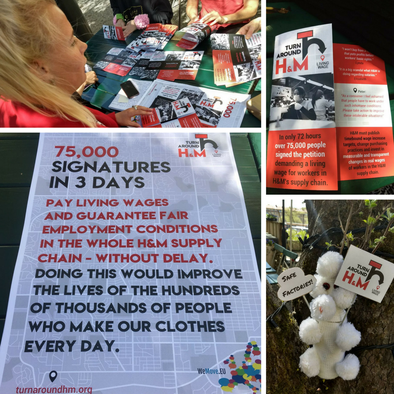
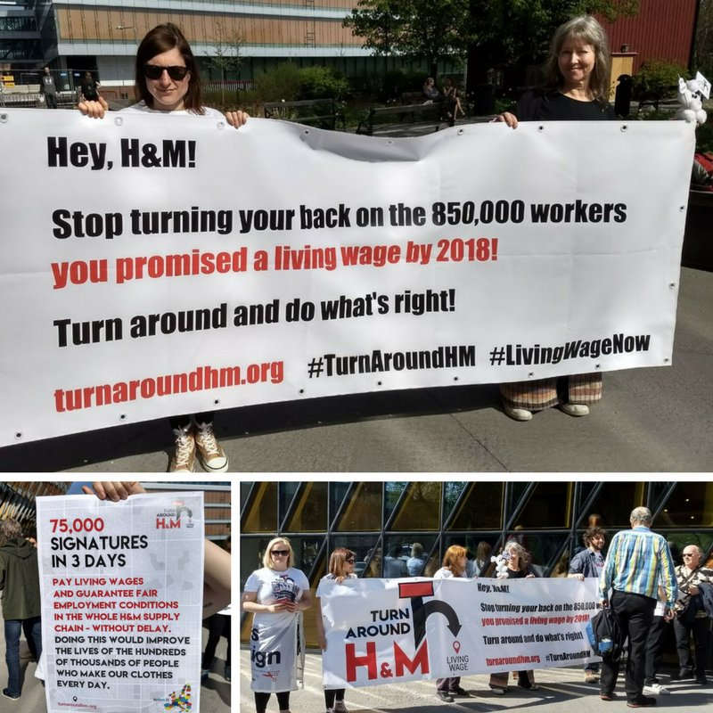
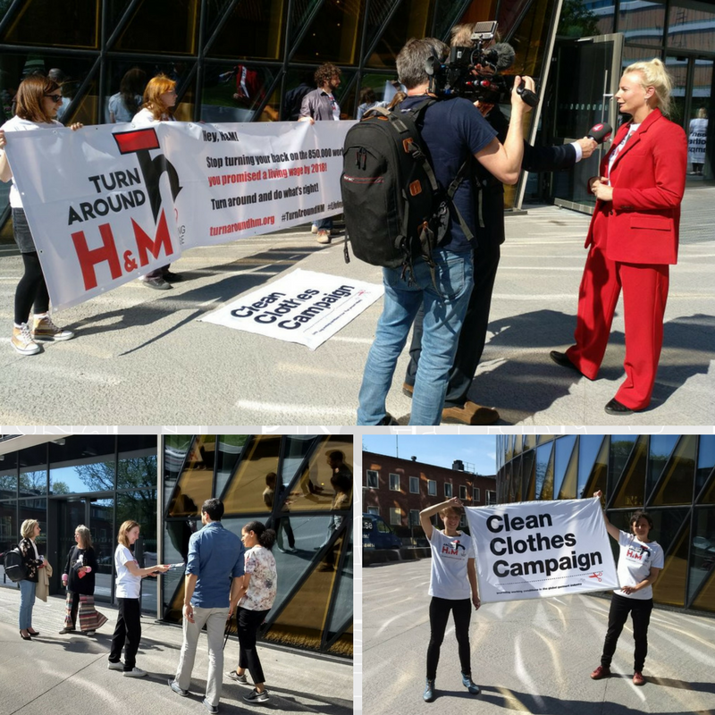
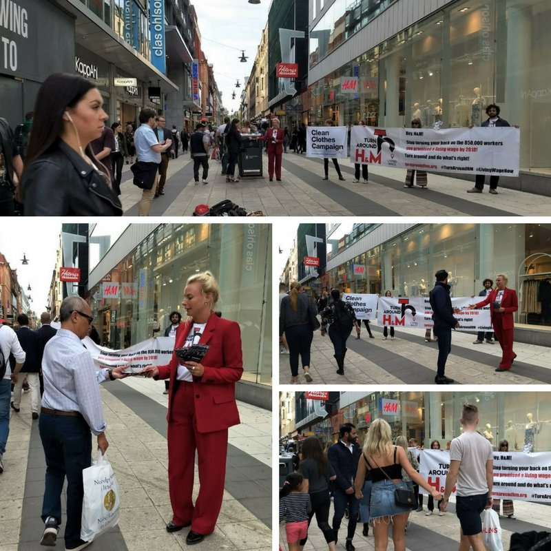
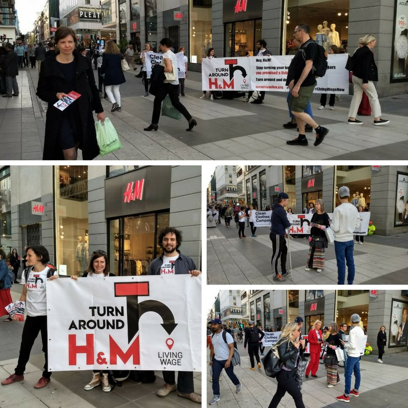
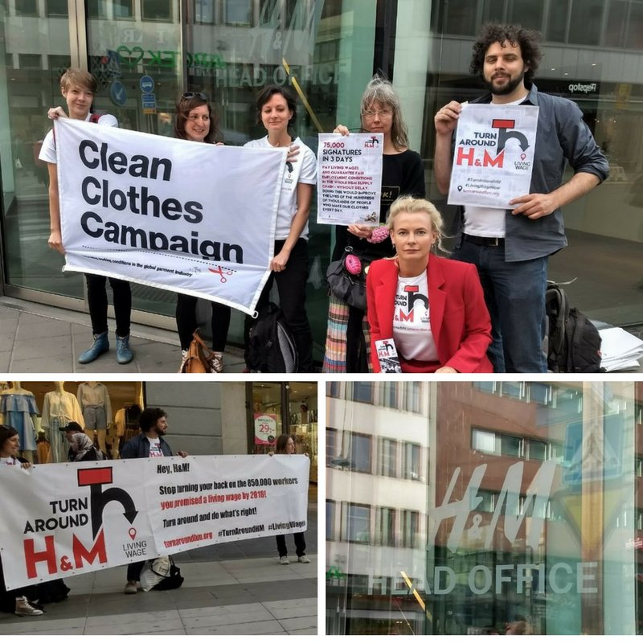

Activists brought the demand for H&M to fulfil the living wage commitment to Stockholm, the company's home base. The annual shareholders meeting took place there today, and #TurnAroundHM campaigners made sure that shareholders were aware of the broad support for the campaign's central demand. Over 75,000 people joined the campaign in just three days <!-- end --> after we had launched [this petition](https://act.wemove.eu/campaigns/760) together with wemove.eu.

\#TurnAroundHM activists getting everything ready for the day of action in Stockholm. They were equipped with posters and handouts that included some of the many comments added to the petition.

First stop: H&M's annual shareholder meeting. Many shareholders walked away with food for thought in the form of our handouts that summarized H&M's promise, the current situation and our key demands.

Apart from the attending shareholders, multiple media outlets also showed an interest in the action, so the demand for H&M to keep its living wage promise is getting an ever wider audience.

Next stop: center of Stockholm, so shoppers were also made aware of H&M's unmet promise. Again, nobody could miss the action, and many people accepted the handouts with further information.

\#TurnAroundHM activists moved on to another H&M store, making sure word of the living wage promise spreads far and wide. Passers-by of all ages showed an interest in the action and H&M's unfulfilled commitment.

Finally, \#TurnAroundHM activists turned up at H&M's head office. We hope that the company's top ranks got the message: You promised workers a living wage by 2018, and we will not let that be forgotten.