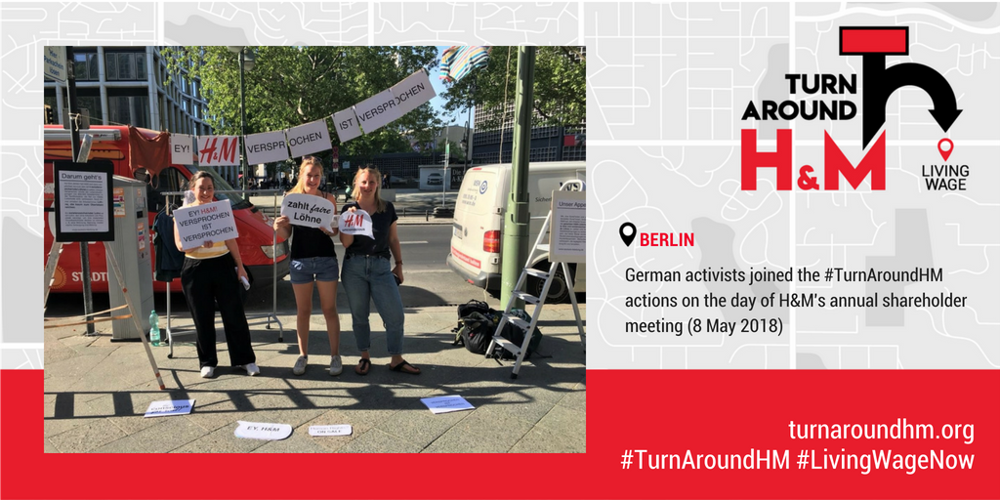

Clean Clothes Campaign national coalitions and other activists supported the #TurnAroundHM day of action in Stockholm in various ways. Media in a number of countries received press releases. CCC representatives gave interviews to local journalists, amplified the campaign on social media, and organized street actions such as the ones in Helsinki and Berlin.
<!-- end -->

In Helsinki activists pretended to be waiting and waiting, referring to the workers' long wait for a living wage.

Sini Saritska of the Trade Union Solidarity Centre contributed this summary:

"We are waiting," says a sign held by a woman who is sitting on a picnic chair on Helsinki's biggest shopping street. Behind her there's the big window of the H&M shop, announcing "Summer celebrations -20 %". The woman yawns. On a blanket there are a couple of people sitting and lounging, reading lazily or chatting. Around them there are some more men and women aimlessly hanging out. Somebody is reading a book, someone else holding his smartphone.  Through the mid-day street noise one can hear sleepy elevator music coming from a small loudspeaker.

People passing by are wondering what is going on, some of them staying and asking for more information. They are given some leaflets. Several photographers are recording the action with their cameras and asking for comments so that they can bring them back to their media houses.

photo credit: SASK/Lassi Kaaria.

This 15-minute flash mob was jointly organized by SASK (Trade Union Solidarity Centre) of Finland and Eetti, and it was also captured in this short video:

`youtube: https://www.youtube.com/watch?v=gcIcBa4Ijps`

"Our message is clear. We are waiting for the giant clothing company to act on its promise. H&M should make sure by the end of this year that workers in its supply chain are earning a salary that can provide a decent living for themselves and their families," said Lotta Staffans of Eetti.

"For SASK it is natural to be part of a flash mob related to the garment workers' rights issues,as this is an important area in the working field of a development cooperation organization of Finnish trade unions," explained Laura Ventä of SASK.

The action took place on Monday, 7 May, and received media attention beyond Finnish borders.

In Berlin activists brought the campaign to the shopping area in Charlottenburg. The main theme and central message of the action was: "A promise is a promise."

Passers-by were not impressed by H&M turning its back on the promise that workers would be paid a living wage by 2018. They supported the campaign demand by taking photos with messages directed at H&M. Here's just a sample:

