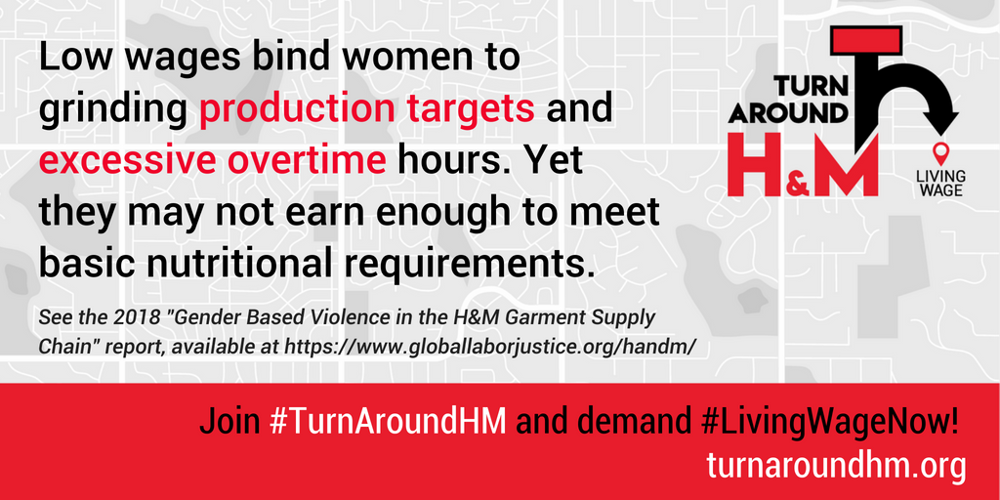

A global coalition of trade unions, worker rights and human rights organizations released a groundbreaking research report documenting gender based violence in H&M garment supply chain. The report points out that H&M’s failure to ensure garment workers are paid a living wage exposes women workers to risks of violence in numerous ways. The coalition calls on H&M take immediate action to end the violence and harassment that women garment workers are forced to endure daily.
<!-- end -->

This new research documents sexual harassment and violence including physical violence, verbal abuse, coercion, threats and retaliation, and routine deprivations of liberty including forced overtime.
“My batch supervisor came up behind me as I was working on the sewing machine, yelling “you are not meeting your target production.” He pulled me out of the chair and I fell on the floor. He hit me, including on my breasts. He pulled me up and then pushed me to the floor again. He kicked me,” reminisced Radikha, who works at an H&M supplier factory in India.

Another woman worker, from an H&M supplier factory in Sri Lanka, recounted facing retaliation for responding to unwanted physical touch: “When girls scold machine operators for touching them or grabbing them, they take revenge. Sometimes they give them machines that do not function properly. Then, they do not come and repair it for a long time. After that, supervisors scold us for not meeting the target.”
The research – conducted in Bangladesh, Cambodia, Indonesia, India and Sri Lanka – also makes clear these are not isolated incidents; gender based violence is a direct result of how brands conduct business.

The report points out that the continued failure by H&M suppliers to pay a living wage – despite H&M having committed in 2013 to changing this fact – exposes women garment workers to risks of violence in numerous ways.

Low wages bind women to grinding production targets and excessive overtime hours—and, even then, they may not earn enough to meet basic nutritional requirements for themselves and their families.
Women employed at H&M supplier factories in India discussed the challenges they faced in purchasing nutritional food and affording decent housing on the wages they earn:

> “We buy low quality food products and dresses that are cheaper. We usually cook potatoes with flat bread. Milk products, meat, and fish are far from our reach.”

> “We carry some of the food grains from our native place so that we can save money on food. Even basic food items are much more costly over here.”

> “We buy things in small quantities. Our income is low and we do not space to keep anything in our one room. There is no kitchen. We have no ventilation for fresh air.”

>“Our salary is so low that I can’t afford the food that is available in the factory canteen. Even that is out of my reach.”

The coalition behind the reports includes Asia Floor Wage Alliance (AFWA), CENTRAL Cambodia, Global Labor Justice, Sedane Labour Resource Centre (LIPS) Indonesia, and Society for Labour and Development (SLD) India.

The [H&M](https://www.globallaborjustice.org/handm/) report was released along with the report on [Gap](https://www.globallaborjustice.org/gap/). Last week, the same global coalition released a report on gender based violence in [Walmart](https://www.globallaborjustice.org/walmart/) supply chain.

These reports should ring alarm bells for all garment brands and are adding extra fuel to our “Turn Around, H&M!” campaign. We are, yet again, calling upon H&M to stop turning its back on the garment workers who were promised a living wage by 2018. They continue to live in poverty while H&M reports USD 2.6 billion profits.
In less than one month, close to 100,000 people have added their voices to the demand for H&M to ensure without delay that workers are paid a living wage.
Add your voice by signing [this petition](https://act.wemove.eu/campaigns/760).

