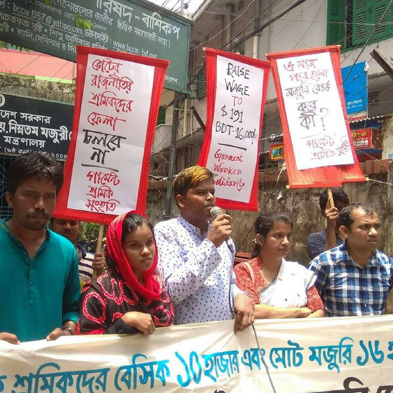
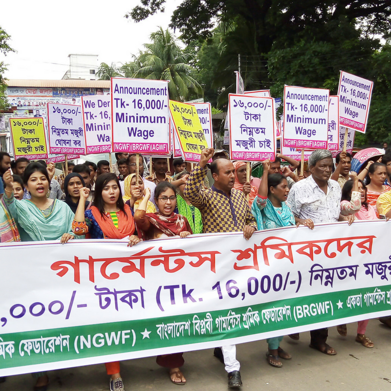

Clean Clothes Campaign has urged H&M to show leadership on the way toward living wages for garment workers in Bangladesh who are due to finally have their minimum wage revised.
Despite paying lip service to the need for a minimum wage increase, H&M has so far failed to publicly support workers’ demands.
<!-- end -->

H&M is one of the biggest garments buyers in Bangladesh. The brand sources from 304 factories in the country and therefore has a big influence on the setting of minimum wages. These are currently some of the lowest in the global garment industry, and workers are asking for an increase of the minimum wage from 5,300 taka to 16,000 taka (191 USD). This demand has been formally submitted to the minimum wage board by the Bangladesh Council of the global union federation IndustriALL and has broad support among trade unions, NGOs and other organizations.

At the beginning of this year the government of Bangladesh finally announced the first minimum wage revision since 2013, but the process has been delayed and meetings of the minimum wage board have been postponed multiple times.

The current minimum wage is far from sufficient even to meet basic needs, and workers have been peacefully voicing the urgent need for an increase for years. Their demands have been met with violence and repression, so the workers’ minimum wage struggle is taking place in a toxic atmosphere of fear and human rights violations. 

H&M – along with other major brands sourcing from Bangladesh – received a letter in April with a request for them to publicly support workers’ demands (they are detailed [here](https://cleanclothes.org/news/2018/07/06/full-support-for-bangladeshi-garment-workers2019-demands-on-minimum-wage).
In addition, Clean Clothes Campaign asked H&M to publicly make a long-term commitment to continue sourcing from Bangladesh after the wage increase; agree to increase the prices they pay their suppliers (i.e. the FoB price) to allow for the wage increase to be met in practice; express concern at the repression and harassment of trade unions leaders; and make it clear that they support their genuine engagement in the negotiation process.

The [letter](https://cleanclothes.org/news/2018/04/25/brands-sourcing-from-bangladesh-urged-to-support-workers2019-minimum-wage-demands) did not go entirely unanswered, which was the case with a number of other brands. However, H&M only responded directly to Clean Clothes Campaign without taking any of the specified steps to concretely support the impoverished workers in the ongoing minimum wage struggle – unlike in Cambodia five years ago when H&M did take on an active role in similar circumstances.

The Bangladeshi minimum wage board will reconvene on 16 July.

Knock, knock, H&M!

- A [recent example of the repression and harassment of workers and trade unionists](https://cleanclothes.org/news/2018/07/06/2018/04/07/clean-clothes-campaign-calls-for-immediate-release-of-bangladesh-trade-unionists-held-on-false-charges)
- For more information on the situation in Bangladesh since the wage strike of December 2016 and the crackdown that followed, see [the white paper](https://cleanclothes.org/news/2018/07/resources/publications/the-european-union-and-the-bangladesh-garment-industry-the-failure-of-the-sustainability-compact/view) prepared by Clean Clothes Campaign, the International Trade Union Confederation, the European Trade Union Confederation, IndustriALL Global Union and UNI Global Union; and [the earlier call for a trade investigation by the European Union](https://cleanclothes.org/news/2018/07/resources/publications/european-union-and-the-bangladesh-garment-industry-the-case-for-a-trade-investigation/view).