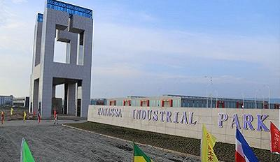

H&M is busy expanding production around the globe, searching for the cheapest possible labor - despite their promises to the contrary. A piece this month exposed labor abuses at the Hawassa Industrial Park in Ethiopia, H&M’s latest sourcing location.
<!-- end -->

[See article](https://theintercept.com/2018/07/08/ethiopia-garment-industry/)

This shift in production is neither accidental nor unexpected. Ethiopia has [no national minimum wage](http://www.ilo.org/wcmsp5/groups/public/---africa/---ro-addis_ababa/---sro-addis_ababa/documents/genericdocument/wcms_573550.pdf) for private sector workers, and the base salary for garment workers in the country is among the lowest in the world – less than $1 a day.
H&M has declined to [give any figures](https://theintercept.com/2018/07/08/ethiopia-garment-industry/) for what it believes is a living wage in Ethiopia, leaving consumers and activists to wonder where these workers fit into the [brand’s living wage promise](https://www.nytimes.com/2013/12/02/opinion/a-swedish-retailer-promises-a-living-wage.html).

When H&M promised to pay a living wage by 2018, there was good reason to be skeptical. At the start, H&M’s global head of sustainability Helena Helmersson [announced](https://www.reuters.com/article/hm-wages/hm-aims-to-pay-all-textile-workers-living-wage-by-2018-idUSL5N0JA30R20131125) “We are willing to pay more so that the supplier can pay higher wages. We believe that our purchasing practices will lead to better efficiency and productivity.” 
Five years on from the initial promise, the company has hedged its initial commitment significantly. Now, its goal is to, [“set up democratically elected worker representatives committees and improved wage management systems at suppliers representing 50 percent of our product volume.”](https://theintercept.com/2018/07/08/ethiopia-garment-industry/) Nowhere in this latest declaration does H&M mention actually paying workers more.

H&M bills itself as a sustainable brand, complementing its 2013 living wage commitment with token promotions like a “Conscious Collection” and in-store recycling discounts.
But, in reality, the company epitomizes fast fashion brands, and the swaths of damage they leave in their wake. In the midst of finding cheaper, more poorly regulated sourcing locations, H&M is struggling to offload [$4 billion in unsold inventory](https://money.cnn.com/2018/06/28/investing/hm-unsold-clothes-profits/index.html), in some cases resorting to [burning unsold clothing](https://www.greenpeace.org/archive-international/en/news/Blogs/makingwaves/hm-burning-new-clothes-fast-fashion-incineration/blog/60640/) to cover up the problem. Despite the clothing overload, it continues to churn out clothing at such a rapid pace and the company can’t even manage to screen out [blatantly racist and offensive images](https://www.seattletimes.com/business/wapowhy-retailers-like-zara-and-h-m-keep-making-headlines-for-offensive-clothing/) in new designs.

Even more concerning, H&M’s failure to pay workers a living wage is intimately connected to the recent exposure of horrific gender-based violence in its supply chain, and it’s critical that the relationship between the two not be overlooked. A [recent report](https://www.globallaborjustice.org/wp-content/uploads/2018/05/GBV-HM-May-2018.pdf) by Global Labor Justice, Asian Floor Wage Alliance and others identified incidents of violence, as well as risk factors for violence, in factories producing for H&M. The report found that “low wages bind women to grinding production targets and excessive overtime hours—and, even then, they may not earn enough to meet basic nutritional requirements for themselves and their families.” The reliance on meager wages puts women and other vulnerable workers in a position to choose between enduring violence at work, or not being able to afford basic necessities.

The company risks alienating their consumer base and setting a dangerous precedent if it fails to follow through on its original commitment. Already, activists and consumers are coming together in the international [Turn Around, H&M](https://turnaroundhm.org) campaign to let H&M know that this publicity stunt won’t be accepted as a stand-in for paying workers what they need to survive. Nearly 100,000 people have signed a [petition](https://act.wemove.eu/campaigns/760) calling for H&M to pay living wages and guarantee fair employment conditions in its whole supply chain - without delay. With just five months left in the year, H&M doesn’t have much time remaining to keep its promise.

[Sarah Newell, International Labor Rights Forum](https://laborrights.org/blog/authors/sarah-newell-international-labor-rights-forum)